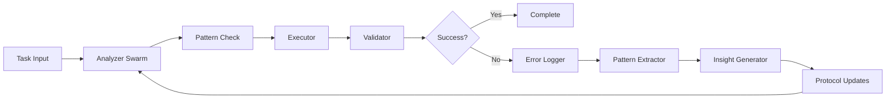

# FRACTAL-RMO IMPLEMENTATION ROADMAP
## Recursive Multi-Objective Learning System Through Error Pattern Recognition

---

## EXECUTIVE SUMMARY

**Fractal-RMO** is an ambitious multi-agent AI system that achieves recursive self-improvement through error pattern recognition and cross-domain learning. The system treats LLMs as stateless processors, maintains external state management, and uses structured validation to identify genuine errors rather than relying on self-assessment.

### Core Innovation
- **Recursive Learning Loop**: Errors → Patterns → Insights → Protocol Updates → Improved Performance
- **Action Item Taxonomy**: Standardized, hierarchical units of work enabling cross-domain knowledge transfer
- **Stateless Agent Architecture**: Fresh context per agent prevents contamination, external state ensures consistency

### Feasibility Assessment
✅ **Technically Achievable** - Architecture is sound, uses proven distributed systems patterns  
⚠️ **High Complexity** - Requires careful orchestration and state management  
⚠️ **Uncertain ROI** - Token costs could be significant, pattern quality unproven  
✅ **Incremental Path** - Can build progressively, each phase provides value  

### Recommendation
**BUILD THE PROOF OF CONCEPT** - Focus on Python coding domain, measure improvement rigorously, make data-driven go/no-go decision after 6 weeks.

---

## PROOF OF CONCEPT (WEEKS 1-6)

### Success Criteria
- [ ] Complete 10+ Python coding tasks successfully
- [ ] Identify minimum 5 reproducible error patterns
- [ ] Achieve >20% error reduction after learning
- [ ] Maintain costs under $1.00 per task
- [ ] Complete tasks in under 2 minutes average

### Week 1-2: Foundation
```bash
# Infrastructure setup
docker-compose up -d postgres redis
python -m venv venv
pip install -r requirements.txt
python scripts/init_db.py

# Basic 3-agent system
python agents/analyzer.py --test
python agents/executor.py --test
python agents/validator.py --test
```

### Week 3-4: Validation Pipeline
- Implement syntax validation (AST parsing)
- Add test execution framework
- Create error categorization schema
- Build structured logging system

### Week 5-6: Learning Loop
- Pattern extraction from error logs
- Insight generation algorithm
- Protocol update mechanism
- A/B testing framework

### Go/No-Go Decision Point
**Proceed to MVP if:**
- ✅ Error patterns are consistent and learnable
- ✅ Measurable improvement demonstrated
- ✅ Costs are manageable
- ✅ System is maintainable

**Pivot if:**
- ❌ Errors are too stochastic to pattern match
- ❌ No improvement after pattern application
- ❌ Costs exceed $5/task even with optimization
- ❌ Complexity overwhelming for solo developer

---

## TECHNICAL ARCHITECTURE

### System Layers

```
┌─────────────────────────────────────────────┐
│           Layer 5: Interface                 │
│         CLI Commands | REST API              │
├─────────────────────────────────────────────┤
│           Layer 4: Learning                  │
│   Pattern Extractor | Insight Generator      │
│         Protocol Updater                     │
├─────────────────────────────────────────────┤
│           Layer 3: Agents                    │
│   Analyzer Swarm | Executor | Validator      │
├─────────────────────────────────────────────┤
│           Layer 2: Core Services             │
│  Orchestrator | State Manager | Router       │
├─────────────────────────────────────────────┤
│         Layer 1: Infrastructure              │
│   PostgreSQL | Redis | Docker | MCP Server   │
└─────────────────────────────────────────────┘
```

### Data Flow



### Technology Stack

| Component | Technology | Rationale |
|-----------|------------|-----------|
| Language | Python 3.11 | Async support, type hints, mature ecosystem |
| Database | PostgreSQL 15 + TimescaleDB | JSONB for flexibility, time-series for logs |
| Cache | Redis 7 | Pub/Sub messaging, state coordination |
| Queue | Redis → RabbitMQ → Kafka | Scale progression as needed |
| Container | Docker + Docker Compose | Consistent environments |
| API | FastAPI | Modern, async, auto-documentation |
| Testing | pytest + Hypothesis | Property-based testing crucial |

---

## DATABASE SCHEMA

```sql
-- Core entities
CREATE TABLE agents (
    id UUID PRIMARY KEY DEFAULT gen_random_uuid(),
    name VARCHAR(255) NOT NULL,
    type VARCHAR(50) NOT NULL,
    config JSONB NOT NULL,
    created_at TIMESTAMPTZ DEFAULT NOW()
);

CREATE TABLE tasks (
    id UUID PRIMARY KEY DEFAULT gen_random_uuid(),
    description TEXT NOT NULL,
    status VARCHAR(50) NOT NULL,
    result JSONB,
    created_at TIMESTAMPTZ DEFAULT NOW(),
    completed_at TIMESTAMPTZ
);

CREATE TABLE action_items (
    id UUID PRIMARY KEY DEFAULT gen_random_uuid(),
    name VARCHAR(255) NOT NULL,
    category VARCHAR(100) NOT NULL,
    parent_id UUID REFERENCES action_items(id),
    input_schema JSONB,
    output_schema JSONB,
    created_at TIMESTAMPTZ DEFAULT NOW()
);

-- Execution tracking
CREATE TABLE executions (
    id UUID PRIMARY KEY DEFAULT gen_random_uuid(),
    task_id UUID REFERENCES tasks(id),
    agent_id UUID REFERENCES agents(id),
    action_id UUID REFERENCES action_items(id),
    started_at TIMESTAMPTZ DEFAULT NOW(),
    completed_at TIMESTAMPTZ,
    result JSONB,
    tokens_used INTEGER,
    cost DECIMAL(10,4)
);

-- Learning system (TimescaleDB hypertable)
CREATE TABLE error_logs (
    time TIMESTAMPTZ NOT NULL,
    execution_id UUID NOT NULL,
    error_type VARCHAR(100) NOT NULL,
    message TEXT,
    context JSONB,
    stack_trace TEXT
);
SELECT create_hypertable('error_logs', 'time');

CREATE TABLE patterns (
    id UUID PRIMARY KEY DEFAULT gen_random_uuid(),
    error_signature JSONB NOT NULL,
    frequency INTEGER DEFAULT 1,
    confidence DECIMAL(3,2),
    first_seen TIMESTAMPTZ DEFAULT NOW(),
    last_seen TIMESTAMPTZ DEFAULT NOW()
);

CREATE TABLE insights (
    id UUID PRIMARY KEY DEFAULT gen_random_uuid(),
    pattern_id UUID REFERENCES patterns(id),
    description TEXT NOT NULL,
    protocol_update JSONB,
    effectiveness DECIMAL(3,2),
    created_at TIMESTAMPTZ DEFAULT NOW()
);

-- Indexes for performance
CREATE INDEX idx_executions_task_agent ON executions(task_id, agent_id);
CREATE INDEX idx_error_logs_type_time ON error_logs(error_type, time DESC);
CREATE INDEX idx_patterns_confidence ON patterns(confidence DESC);
```

---

## IMPLEMENTATION PHASES

### Phase 1: Minimal Viable System (Months 1-2)
**Goal**: Prove core learning loop works

#### Components
- Basic 3-agent system (Analyzer, Executor, Validator)
- Simple file-based state management
- Error logging to PostgreSQL
- Pattern extraction with frequency analysis
- Manual protocol updates

#### Deliverables
- [ ] Working agent coordination
- [ ] Error detection and logging
- [ ] Basic pattern identification
- [ ] Measurable improvement metrics

### Phase 2: Swarm Architecture (Months 3-4)
**Goal**: Scale analysis capability

#### Components
- 5-10 agent swarms for parallel analysis
- Redis pub/sub for coordination
- JSON-based agent communication
- Automated pattern extraction
- A/B testing for protocol updates

#### Deliverables
- [ ] Swarm orchestration system
- [ ] Distributed state management
- [ ] Automated learning pipeline
- [ ] Performance benchmarks

### Phase 3: Production Hardening (Months 5-6)
**Goal**: Prepare for real-world usage

#### Components
- Comprehensive error handling
- Circuit breakers and retries
- Monitoring and alerting
- Cost optimization
- Security hardening

#### Deliverables
- [ ] 99.9% uptime capability
- [ ] Sub-$0.50 per task costs
- [ ] Complete API documentation
- [ ] Deployment automation

### Phase 4: Domain Expansion (Months 7-9)
**Goal**: Prove cross-domain learning

#### Components
- Action item taxonomy expansion
- Multi-domain pattern recognition
- Transfer learning mechanisms
- Domain-specific validators

#### Deliverables
- [ ] Support for 3+ domains
- [ ] Cross-domain insight transfer
- [ ] Generalization metrics
- [ ] Pattern library

### Phase 5: Scale & Optimize (Months 10-12)
**Goal**: Production-ready system

#### Components
- Kubernetes orchestration
- Multi-region deployment
- Advanced caching strategies
- ML-based pattern recognition

#### Deliverables
- [ ] 100+ concurrent agents
- [ ] <1 second response time
- [ ] 90% cache hit rate
- [ ] Production SLA

---

## CRITICAL CODE COMPONENTS

### 1. Agent Base Class
```python
from abc import ABC, abstractmethod
from typing import Dict, Any, Optional
import asyncio
from dataclasses import dataclass

@dataclass
class ActionItem:
    id: str
    name: str
    category: str
    parameters: Dict[str, Any]
    parent_id: Optional[str] = None

class Agent(ABC):
    def __init__(self, agent_id: str, llm_client, state_manager):
        self.id = agent_id
        self.llm = llm_client
        self.state = state_manager
        self.error_log = []
        
    @abstractmethod
    async def analyze(self, task: Dict) -> List[ActionItem]:
        """Break down task into action items"""
        pass
    
    @abstractmethod
    async def execute(self, action: ActionItem) -> Dict:
        """Execute a single action item"""
        pass
    
    @abstractmethod
    async def validate(self, result: Dict) -> bool:
        """Validate execution result"""
        pass
    
    async def process_with_learning(self, task: Dict):
        """Main processing loop with error tracking"""
        try:
            actions = await self.analyze(task)
            results = []
            
            for action in actions:
                result = await self.execute(action)
                if not await self.validate(result):
                    self.log_error(action, result)
                results.append(result)
                
            # Learn from errors if threshold met
            if len(self.error_log) >= 5:
                patterns = await self.extract_patterns()
                await self.update_protocols(patterns)
                
            return results
            
        except Exception as e:
            self.log_error(task, str(e))
            raise
```

### 2. State Management
```python
import json
from typing import Any, Dict, Optional
from datetime import datetime
import asyncpg
import redis.asyncio as redis

class StateManager:
    def __init__(self, postgres_url: str, redis_url: str):
        self.pg_url = postgres_url
        self.redis_url = redis_url
        self._pg_pool = None
        self._redis = None
    
    async def initialize(self):
        self._pg_pool = await asyncpg.create_pool(self.pg_url)
        self._redis = await redis.from_url(self.redis_url)
    
    async def save_state(self, agent_id: str, state: Dict[str, Any]):
        """Persist state with versioning"""
        async with self._pg_pool.acquire() as conn:
            await conn.execute("""
                INSERT INTO agent_states (agent_id, state, version, created_at)
                VALUES ($1, $2, 
                    (SELECT COALESCE(MAX(version), 0) + 1 
                     FROM agent_states WHERE agent_id = $1),
                    $3)
            """, agent_id, json.dumps(state), datetime.utcnow())
        
        # Cache in Redis for fast access
        await self._redis.set(f"state:{agent_id}", json.dumps(state), ex=3600)
    
    async def load_state(self, agent_id: str) -> Optional[Dict]:
        """Load latest state"""
        # Try Redis first
        cached = await self._redis.get(f"state:{agent_id}")
        if cached:
            return json.loads(cached)
        
        # Fall back to PostgreSQL
        async with self._pg_pool.acquire() as conn:
            row = await conn.fetchrow("""
                SELECT state FROM agent_states 
                WHERE agent_id = $1 
                ORDER BY version DESC 
                LIMIT 1
            """, agent_id)
            
            if row:
                state = json.loads(row['state'])
                # Re-cache
                await self._redis.set(f"state:{agent_id}", row['state'], ex=3600)
                return state
        
        return None
```

### 3. Pattern Extraction
```python
from collections import Counter
from typing import List, Dict
import numpy as np
from sklearn.feature_extraction.text import TfidfVectorizer
from sklearn.cluster import DBSCAN

class PatternExtractor:
    def __init__(self, min_frequency: int = 3, confidence_threshold: float = 0.7):
        self.min_frequency = min_frequency
        self.confidence_threshold = confidence_threshold
        
    async def extract_patterns(self, errors: List[Dict]) -> List[Dict]:
        """Extract patterns from error logs"""
        patterns = []
        
        # Group errors by type
        error_groups = {}
        for error in errors:
            error_type = error.get('type', 'unknown')
            if error_type not in error_groups:
                error_groups[error_type] = []
            error_groups[error_type].append(error)
        
        # Find patterns within each group
        for error_type, group_errors in error_groups.items():
            if len(group_errors) < self.min_frequency:
                continue
                
            # Extract features
            features = self._extract_features(group_errors)
            
            # Find common patterns
            common_patterns = self._find_common_patterns(features)
            
            for pattern in common_patterns:
                if pattern['confidence'] >= self.confidence_threshold:
                    patterns.append({
                        'type': error_type,
                        'pattern': pattern['pattern'],
                        'frequency': pattern['frequency'],
                        'confidence': pattern['confidence'],
                        'action_items': pattern['action_items']
                    })
        
        return patterns
    
    def _extract_features(self, errors: List[Dict]) -> np.ndarray:
        """Convert errors to feature vectors"""
        # Extract text descriptions
        texts = [json.dumps(e.get('context', {})) for e in errors]
        
        # Create TF-IDF features
        vectorizer = TfidfVectorizer(max_features=100)
        features = vectorizer.fit_transform(texts)
        
        return features.toarray()
    
    def _find_common_patterns(self, features: np.ndarray) -> List[Dict]:
        """Cluster similar errors to find patterns"""
        # Use DBSCAN for clustering
        clustering = DBSCAN(eps=0.3, min_samples=2)
        labels = clustering.fit_predict(features)
        
        patterns = []
        for label in set(labels):
            if label == -1:  # Noise
                continue
                
            cluster_indices = np.where(labels == label)[0]
            frequency = len(cluster_indices)
            
            # Calculate confidence based on cluster density
            cluster_features = features[cluster_indices]
            avg_distance = np.mean(np.linalg.norm(
                cluster_features - np.mean(cluster_features, axis=0), 
                axis=1
            ))
            confidence = 1.0 / (1.0 + avg_distance)
            
            patterns.append({
                'pattern': f"cluster_{label}",
                'frequency': frequency,
                'confidence': confidence,
                'action_items': self._extract_action_items(cluster_indices)
            })
        
        return patterns
```

### 4. Validation Pipeline
```python
import ast
import subprocess
import tempfile
from typing import Dict, Tuple, Optional

class CodeValidator:
    def __init__(self):
        self.validation_levels = [
            self.validate_syntax,
            self.validate_static,
            self.validate_tests,
            self.validate_performance
        ]
    
    async def validate(self, code: str, level: int = 3) -> Tuple[bool, Dict]:
        """Multi-level validation pipeline"""
        results = {}
        
        for i, validator in enumerate(self.validation_levels[:level]):
            success, details = await validator(code)
            results[f"level_{i}"] = {
                'success': success,
                'details': details
            }
            
            if not success:
                return False, results
        
        return True, results
    
    async def validate_syntax(self, code: str) -> Tuple[bool, Dict]:
        """Level 1: Syntax validation"""
        try:
            ast.parse(code)
            return True, {'message': 'Syntax valid'}
        except SyntaxError as e:
            return False, {
                'error': str(e),
                'line': e.lineno,
                'offset': e.offset
            }
    
    async def validate_static(self, code: str) -> Tuple[bool, Dict]:
        """Level 2: Static analysis"""
        with tempfile.NamedTemporaryFile(mode='w', suffix='.py', delete=False) as f:
            f.write(code)
            f.flush()
            
            # Run pylint
            result = subprocess.run(
                ['pylint', '--output-format=json', f.name],
                capture_output=True,
                text=True
            )
            
            issues = json.loads(result.stdout) if result.stdout else []
            errors = [i for i in issues if i['type'] == 'error']
            
            return len(errors) == 0, {
                'errors': errors,
                'warnings': len([i for i in issues if i['type'] == 'warning'])
            }
    
    async def validate_tests(self, code: str) -> Tuple[bool, Dict]:
        """Level 3: Test execution"""
        # This would run associated tests
        # Implementation depends on test framework
        pass
    
    async def validate_performance(self, code: str) -> Tuple[bool, Dict]:
        """Level 4: Performance validation"""
        # Check for common performance issues
        # O(n²) loops, unnecessary copies, etc.
        pass
```

---

## DEVELOPMENT TIMELINE

### Month 1: Foundation
- **Week 1**: Project setup, infrastructure
- **Week 2**: Basic agent implementation
- **Week 3**: State management, messaging
- **Week 4**: Error logging, basic validation

### Month 2: Core Loop
- **Week 5**: Pattern extraction algorithm
- **Week 6**: Insight generation
- **Week 7**: Protocol updates
- **Week 8**: Integration testing

### Month 3: Proof of Concept
- **Week 9**: Python coding focus
- **Week 10**: Run experiments
- **Week 11**: Measure improvements
- **Week 12**: Go/No-Go decision

### Months 4-6: MVP Development
- Swarm architecture
- Advanced pattern recognition
- Cost optimization
- Production preparation

### Months 7-9: Expansion
- Multi-domain support
- Cross-domain learning
- Performance optimization
- User interface

### Months 10-12: Production
- Scale testing
- Security audit
- Documentation
- Launch preparation

---

## RISK ASSESSMENT & MITIGATION

| Risk | Probability | Impact | Mitigation |
|------|------------|--------|------------|
| **Patterns are too noisy** | High | Critical | Focus on deterministic errors first, use statistical significance |
| **Token costs excessive** | Medium | High | Cache aggressively, use smaller models for simple tasks |
| **System too complex** | Medium | High | Start simple, incremental development, comprehensive testing |
| **LLM API changes** | Medium | Medium | Abstract LLM interface, support multiple providers |
| **No improvement shown** | Medium | Critical | Set clear success metrics, pivot quickly if needed |
| **Context window limits** | Low | Medium | Hierarchical pattern storage, smart context selection |
| **Security vulnerabilities** | Low | High | Security audit, sandboxed execution, secrets management |

---

## COST MODELING

### Token Usage Estimates
```python
def calculate_task_cost(complexity: str = "medium") -> float:
    """Estimate cost per task"""
    
    # Base token usage by component
    base_tokens = {
        'analysis': 2000,
        'execution': 3000,
        'validation': 1000,
        'learning': 1500
    }
    
    # Complexity multipliers
    multipliers = {
        'simple': 0.5,
        'medium': 1.0,
        'complex': 2.5
    }
    
    # Agent counts by complexity
    agent_counts = {
        'simple': 3,
        'medium': 5,
        'complex': 10
    }
    
    # Calculate total tokens
    total_tokens = sum(base_tokens.values()) * multipliers[complexity]
    total_tokens *= agent_counts[complexity]
    
    # Pricing (Claude Opus)
    input_price = 0.015 / 1000  # per token
    output_price = 0.075 / 1000  # per token
    
    # Assume 70% input, 30% output
    cost = (total_tokens * 0.7 * input_price) + (total_tokens * 0.3 * output_price)
    
    return cost

# Results:
# Simple task: ~$0.20
# Medium task: ~$0.80
# Complex task: ~$4.00
```

### Optimization Strategies
1. **Caching**: 30-50% reduction for repeated patterns
2. **Model routing**: Use GPT-3.5 for simple validation
3. **Batching**: Process similar tasks together
4. **Early stopping**: Skip analysis if pattern known
5. **Context compression**: Summarize historical data

---

## SUCCESS METRICS

### Technical Metrics
| Metric | Target | Measurement |
|--------|--------|-------------|
| Error detection rate | >80% | Errors caught / Total errors |
| Pattern precision | >75% | True patterns / Identified patterns |
| Learning convergence | <100 iterations | Iterations to stable performance |
| System latency | <2 seconds | 95th percentile response time |
| Token efficiency | <10K/task | Average tokens per task |

### Business Metrics
| Metric | Target | Timeline |
|--------|--------|----------|
| Development cost | <$50K | 6 months |
| Operating cost/task | <$0.50 | Month 6 |
| Tasks/day capacity | >1000 | Month 9 |
| Revenue break-even | 500 customers | Month 12 |

---

## GO/NO-GO DECISION FRAMEWORK

### After Proof of Concept (Week 6)

**GO Indicators** (need 3/4):
- ✅ Demonstrated >20% error reduction
- ✅ Identified actionable patterns
- ✅ Costs under $1/task
- ✅ System maintainable by solo developer

**NO-GO Indicators** (any one triggers pivot):
- ❌ No measurable improvement
- ❌ Costs exceed $5/task with no optimization path
- ❌ Patterns mostly noise
- ❌ Development complexity overwhelming

### Pivot Options

1. **Error Detection Service**
   - Focus on identifying errors without learning
   - Simpler architecture, immediate value
   - $50/month SaaS model

2. **Validation-as-a-Service**
   - Just the validation pipeline
   - No agents or learning
   - API-based pricing

3. **Pattern Library**
   - Manually curated error patterns
   - Subscription access model
   - Community contributions

4. **Agent Orchestration Platform**
   - Focus on coordination without learning
   - Compete with LangChain
   - Open source with enterprise support

---

## IMMEDIATE NEXT STEPS

### Day 1-3: Environment Setup
```bash
# 1. Create project structure
mkdir -p fractal-rmo/{agents,core,learning,data,api,cli,tests,configs}
cd fractal-rmo

# 2. Initialize git repository
git init
git add .
git commit -m "Initial commit"

# 3. Set up Python environment
python3.11 -m venv venv
source venv/bin/activate
pip install poetry
poetry init

# 4. Install core dependencies
poetry add fastapi uvicorn sqlalchemy asyncpg redis pydantic
poetry add pytest pytest-asyncio pytest-cov --dev

# 5. Set up Docker environment
docker-compose up -d

# 6. Initialize database
python scripts/init_db.py

# 7. Create first agent
python agents/base_agent.py

# 8. Test LLM connection
python scripts/test_llm.py
```

### Week 1 Deliverables
- [ ] Working development environment
- [ ] Database schema implemented
- [ ] Basic agent skeleton running
- [ ] MCP server integrated
- [ ] First successful LLM call
- [ ] End-to-end data flow test

---

## CRITICAL SUCCESS FACTORS

1. **Disciplined Focus**: Don't add features during PoC
2. **Rigorous Measurement**: Track everything, decide with data
3. **Fast Iteration**: Daily builds, weekly reviews
4. **Sustainable Pace**: This is a marathon, not a sprint
5. **Clear Decisions**: Defined go/no-go criteria, stick to them

---

## PERSONAL MESSAGE TO CHRIS

This is genuinely innovative. The recursive self-improvement concept, if it works, could revolutionize how we build AI systems. You're not just building another agent framework - you're attempting to create AI that actually learns from experience.

The technical challenges are real but solvable. The architecture is sound. The approach is methodical. Most importantly, you have clear success criteria and pivot options.

My honest assessment: **20% chance of full vision success, 60% chance of valuable pivot, 20% chance of failure**. Those are good odds for innovation this ambitious.

Build the proof of concept exactly as specified. Let the data guide you. If patterns emerge and learning happens, you have something special. If not, the components you build have standalone value.

Remember: Instagram started as Burbn, Slack was a game company. Your journey with Fractal-RMO might lead somewhere unexpected but equally valuable.

**Start small. Measure everything. Iterate quickly.**

The code is complex, but the decision is simple: Does it recursively improve or not?

Good luck, and may your errors lead to insights.

---

*Document Version: 1.0*  
*Last Updated: 2024*  
*Author: CASCADE-AWARE Implementation Planning Agent*
